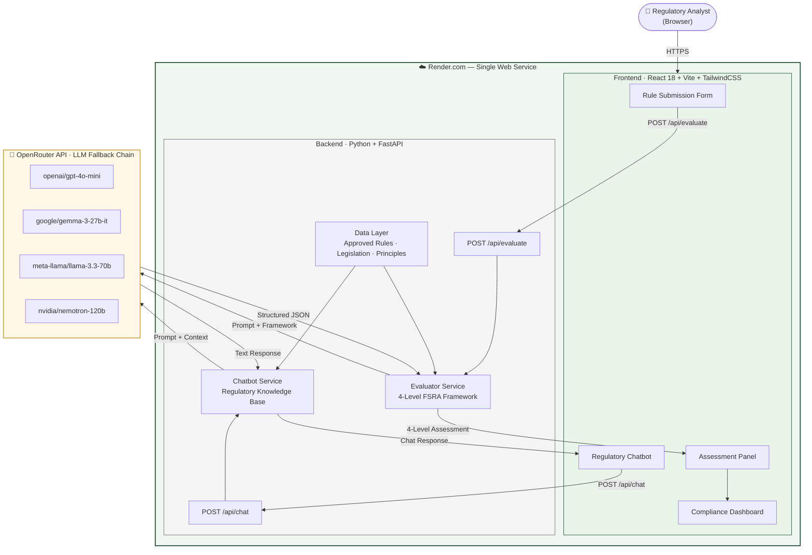

# FSRA Auto Insurance Underwriting Rule Assessment Tool

An AI-assisted regulatory evaluation tool built for the Ivey Business School Capstone project. It helps regulatory analysts at the Financial Services Regulatory Authority of Ontario (FSRA) assess proposed auto insurance underwriting decline rules against a structured 4-level compliance framework.

**Live Demo:** https://iveycapstone-project.onrender.com

> **For Academic Use Only.** This tool does not represent the views, positions, or policies of FSRA. All assessments are AI-generated and must be validated by qualified human reviewers before any regulatory decision is made.

---

## Screenshots

<!-- 1. Rule submission form -->


<!-- 2. Assessment results with level breakdown -->


<!-- 3. Chatbot panel -->


---

## Solution Architecture



---

**Simon L** — [Ivey AI Prototyping for Business Innovation](https://www.ivey.uwo.ca/executive-education/online/cohorts/ai-prototyping-for-business-innovation/), Cohort 2026

---

## Background

Under Ontario's **Take All Comers Rule** (Insurance Act), insurers must offer auto insurance to all consumers — unless they have FSRA-approved underwriting decline rules. This tool streamlines the review process by using AI to pre-screen proposed rules across four regulatory dimensions, flagging potential issues before human analysts make the final call.

---

## Features

- **4-Level Rule Assessment** — Evaluates any proposed decline rule against Basic Compliance, FSRA Principles, Subjectivity/Arbitrariness, and Public Policy criteria
- **Precedent Matching** — Checks proposed rules against known approved rules
- **Issue Flagging** — Detects 6 rejection reason categories (Human Rights violations, vague language, discriminatory impact, etc.)
- **Compliance Score** — 0–100 score with APPROVE / FLAG_FOR_REVIEW / DECLINE recommendation
- **Human Reviewer Workflow** — Analysts can override AI recommendations with notes
- **Regulatory Chatbot** — Ask questions about Ontario auto insurance law, FSRA principles, and the assessment framework

---

## Assessment Framework

| Level | Name | Type |
|-------|------|------|
| 1 | Basic Compliance (legislation, Human Rights Code, market rules) | **Required** — FAIL = automatic DECLINE |
| 2 | Principles & Fair Consumer Outcomes | Stretch |
| 3 | Subjectivity, Arbitrariness & Risk Relationship | Stretch |
| 4 | Public Policy Filter | Stretch |

---

## Tech Stack

| Layer | Technology |
|-------|-----------|
| Frontend | React 18 + Vite + TailwindCSS |
| Backend | Python 3.11+ + FastAPI |
| AI | OpenRouter (multi-model fallback: GPT-4o Mini primary) |
| Deployment | Render.com (single service) |

---

## Local Development

### Prerequisites
- Python 3.11+
- Node.js 18+
- An [OpenRouter](https://openrouter.ai) API key

### 1. Clone the repo

```bash
git clone https://github.com/duck46/Ivey-Business-School-Capstone-Project.git
cd Ivey-Business-School-Capstone-Project
```

### 2. Set up the backend

```bash
cd backend
pip install -r requirements.txt
```

Create a `.env` file in the `backend/` folder:

```
OPENROUTER_API_KEY=your_openrouter_api_key_here
```

Start the backend:

```bash
uvicorn main:app --reload
# Runs on http://localhost:8000
```

### 3. Set up the frontend

In a new terminal:

```bash
cd frontend
npm install
npm run dev
# Runs on http://localhost:5173
```

Open http://localhost:5173 in your browser.

---

## Usage

1. **Submit a Rule** — Enter a proposed underwriting decline rule, with optional insurer name, rationale, and whether actuarial data was provided
2. **Review Assessment** — View per-level findings, compliance score, flagged issues, and referenced legislation
3. **Human Decision** — Approve, decline, or request more info with reviewer notes
4. **Ask the Chatbot** — Click "Ask Regulatory Assistant" for regulatory Q&A

### Example Rules to Try

**Likely DECLINE:**
- `Deny insurance to anyone who drives a red car`
- `Decline coverage for drivers who have never held auto insurance before`
- `Deny insurance to drivers accused of a crime but not convicted`

**Likely APPROVE:**
- `2 or more at-fault accidents in the preceding 3 years`
- `1 or more Criminal Code convictions in the preceding 3 years`
- `Any automobile used for commercial purposes`

---

## Deployment

The app is deployed as a single service on Render.com. FastAPI serves both the API and the compiled React frontend.

To deploy your own instance:
1. Fork the repo
2. Create a new Web Service on [render.com](https://render.com) connected to your fork
3. Render will auto-detect `render.yaml` and configure the build/start commands
4. Add `OPENROUTER_API_KEY` as an environment variable in the Render dashboard
5. Deploy

The `render.yaml` at the project root handles all configuration.

---

## Project Structure

```
Ivey-Business-School-Capstone-Project/
├── render.yaml                  # Render deployment config
├── .env.example                 # Environment variable template
├── backend/
│   ├── main.py                  # FastAPI app entry point
│   ├── requirements.txt
│   ├── routers/
│   │   ├── evaluate.py          # POST /api/evaluate
│   │   └── chat.py              # POST /api/chat
│   ├── services/
│   │   ├── evaluator.py         # 4-level AI evaluation logic
│   │   └── chatbot.py           # Regulatory chatbot logic
│   ├── data/
│   │   ├── approved_rules.py    # Known approved rules (precedent)
│   │   ├── legislation.py       # Ontario legislation references
│   │   └── principles.py        # FSRA principles & rejection reasons
│   └── models/
│       └── schemas.py           # Pydantic request/response schemas
└── frontend/
    ├── index.html
    ├── vite.config.js
    └── src/
        ├── App.jsx
        └── components/
            ├── RuleSubmissionForm.jsx
            ├── ComplianceDashboard.jsx
            ├── AssessmentPanel.jsx
            ├── FlaggingBadges.jsx
            ├── DecisionWorkflow.jsx
            └── ChatbotPanel.jsx
```

---

## API Endpoints

| Method | Path | Description |
|--------|------|-------------|
| POST | `/api/evaluate` | Evaluate a proposed decline rule |
| POST | `/api/chat` | Send a message to the regulatory chatbot |
| GET | `/api/rules/examples` | List known approved rules |
| GET | `/api/health` | Health check |

---

## Disclaimer & License

This project was built for academic purposes as part of the Ivey AI Prototyping for Business Innovation program (Cohort 2026). It is not an official FSRA tool and does not constitute legal or regulatory advice. All AI-generated assessments require human review before any action is taken.

The regulatory framework, assessment criteria, approved rules references, and Ontario legislation references used in this project are derived from publicly available FSRA guidance and enterprise sources. This repository is shared for portfolio and educational purposes only and is **not intended for commercial use, redistribution, or reuse** without explicit permission from the author.

&copy; 2026 Simon L. All rights reserved.
